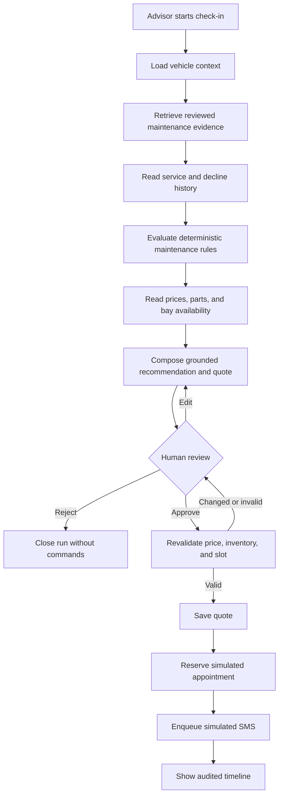

# Service Advisor AI — Independent Automotive Shop MVP

**Status:** Ready for implementation  
**Triage label:** `ready-for-agent`  
**Target market:** Independent automotive service shops in Mexico  
**Demo operating model:** One shop, multi-tenant-ready schema

## Problem Statement

Service advisors at independent automotive shops must assemble maintenance recommendations while a customer is checking in. The information needed to do this well is usually fragmented across vehicle records, service history, declined work, manufacturer maintenance documents, service pricing, parts inventory, appointment capacity, and prior customer conversations.

This creates a slow and inconsistent process. Advisors may overlook an already-completed service, fail to follow up on declined work, recommend maintenance without sufficient manufacturer evidence, quote an unavailable service, or spend too much time manually searching documents and operational systems. Customers then receive recommendations that are difficult to explain and trust.

The portfolio project must demonstrate how an AI engineer can solve this problem without giving a language model unsafe authority. The solution must combine retrieval-augmented generation, embeddings, constrained Text-to-SQL, voice transcription, explicit workflow orchestration, operational data, human approval, observability, and rigorous evaluation. It must be deployable as a public demo, not dependent on local infrastructure, and safe enough to show production-oriented architectural judgment.

## Solution

Build a service-advisor copilot for a Quick Lane-style independent shop. During check-in, an advisor selects a customer and vehicle, confirms current mileage and operating conditions, and optionally records a short voice note. Within a target of two minutes, the system presents a structured vehicle workspace showing overdue, due-now, due-soon, completed, and declined services.

Every actionable recommendation is produced by a deterministic maintenance-rule engine using reviewed, versioned rules derived from official manufacturer documents. Retrieval supplies the supporting document passages and exact citations. Read-only operational tools supply vehicle history, prices, parts availability, and shop capacity. The LLM is limited to intent routing, workflow assistance, explanation, and constrained message composition; it is not the authority on whether maintenance is due and cannot write directly to operational tables.

An advisor can review and edit the recommendation and quotation. Only after explicit human approval may a deterministic application command save the approved quote, reserve a simulated appointment, or enqueue a simulated SMS. The demo clearly labels all synthetic records and simulated delivery states.

The deployed system uses an English advisor interface and English code, schemas, prompts, and technical documentation. Customer-facing messages default to Mexican Spanish, with an optional English version.

## User Stories

1. As a service advisor, I want to choose my demo role when entering the application, so that I can demonstrate the workflow available to that role.
2. As a manager, I want the backend to enforce the role selected for my signed demo session, so that role switching is not merely a visual frontend effect.
3. As an administrator, I want demo sessions to expire automatically, so that public visitors do not retain durable privileges.
4. As a service advisor, I want to search for a customer or vehicle, so that I can begin check-in without navigating multiple systems.
5. As a service advisor, I want search results to show only the information required for service advising, so that unnecessary personal data is not exposed.
6. As a service advisor, I want to select one of the supported canonical vehicle configurations, so that maintenance rules match the exact model, year, engine, drivetrain, and market assumptions.
7. As a service advisor, I want to see the vehicle's previous mileage and recorded date, so that I can identify suspicious or stale check-in data.
8. As a service advisor, I want to confirm the current odometer reading and check-in date, so that time- and mileage-based maintenance can be evaluated correctly.
9. As a service advisor, I want to classify normal or severe operating conditions, so that the applicable maintenance interval is explicit.
10. As a service advisor, I want to record severe-use factors such as traffic and idling, short trips, dust, towing, and extreme heat, so that the recommendation explains why a severe schedule applies.
11. As a service advisor, I want to enter customer concerns in writing, so that the copilot can include relevant context without treating the concern as a diagnosis.
12. As a service advisor, I want to record a voice note of up to 90 seconds in English or Spanish, so that check-in remains fast.
13. As a service advisor, I want to review and edit the transcript before it enters the recommendation workflow, so that transcription errors cannot trigger downstream reasoning.
14. As a service advisor, I want a failed transcription to leave me a manual-entry option, so that provider downtime does not block check-in.
15. As a customer, I want my voice recording deleted after transcript confirmation, so that the system retains no unnecessary audio.
16. As a service advisor, I want to enter the customer's desired appointment window, so that returned slots are operationally relevant.
17. As a service advisor, I want to record consent to prepare a customer message, so that messaging remains an intentional human-controlled step.
18. As a service advisor, I want to start one recommendation run and receive a run identifier immediately, so that I can reconnect without restarting work.
19. As a service advisor, I want to see live workflow progress, so that a cold start or model call does not look like a frozen application.
20. As a service advisor, I want a reconnecting browser to resume the existing run, so that tools are not executed twice.
21. As a service advisor, I want the system to load the vehicle, mileage, service history, declined work, and message context, so that the recommendation reflects the customer record.
22. As a service advisor, I want maintenance evidence filtered to the exact supported vehicle configuration and market, so that documents from incompatible vehicles or countries are not silently mixed.
23. As a service advisor, I want each recommendation classified as overdue, due now, due soon, completed, or declined, so that I can understand its operational status immediately.
24. As a service advisor, I want to know whether a service is due because of mileage, elapsed time, a maintenance indicator, or severe use, so that I can explain it to the customer.
25. As a service advisor, I want to see the rule and immutable rule version used, so that a recommendation remains auditable after rules change.
26. As a service advisor, I want to open the exact manufacturer document page and section supporting a recommendation, so that I can verify it rather than trust generated prose.
27. As a service advisor, I want to see the last equivalent completed service, so that the system does not recommend duplicate maintenance.
28. As a service advisor, I want previous declines called out separately from completed work, so that I can follow up without claiming the service was performed.
29. As a service advisor, I want contradictory or insufficient evidence displayed as a warning, so that uncertainty is visible.
30. As a service advisor, I want a service without a reviewed rule and valid citation to remain informational, so that unsupported content cannot enter an actionable quote.
31. As a service advisor, I want current service prices, labor, parts, duration, and taxes, so that I can prepare a transparent quotation.
32. As a service advisor, I want prices shown in MXN with IVA clearly separated, so that the quote matches the target market.
33. As a service advisor, I want parts availability and restock status shown, so that I do not promise work the shop cannot perform.
34. As a service advisor, I want service fitment checked against the exact vehicle configuration, so that incompatible parts are not quoted.
35. As a service advisor, I want suggested appointment slots based on bay capacity and desired window, so that availability is credible without requiring technician-level scheduling.
36. As a service advisor, I want bundled services to avoid duplicated labor or parts, so that the customer is not overcharged.
37. As a service advisor, I want missing price, part, or slot data stated explicitly, so that the model cannot invent operational facts.
38. As a service advisor, I want a structured quote draft generated from approved service identifiers, so that free-form generation cannot change the work being sold.
39. As a service advisor, I want the quote to retain a snapshot of price, tax, inventory, and availability inputs, so that later changes can be detected.
40. As a service advisor, I want price, inventory, and slot availability revalidated immediately before approval, so that stale data invalidates the prior approval instead of silently proceeding.
41. As a service advisor, I want to edit the recommendation and customer-facing language before approval, so that the human remains accountable for the final communication.
42. As a service advisor, I want to approve, edit, or reject a recommendation, so that AI output never moves forward automatically.
43. As a service advisor, I want an ordinary quote within policy limits to be approvable by my role, so that normal check-ins remain efficient.
44. As a manager, I want quotes above MXN 15,000, repeated declined services, changed operational data, or policy exceptions routed to me, so that higher-risk decisions receive additional review.
45. As an administrator, I want missing or contradictory evidence to be non-overridable by every role, so that privileged access cannot bypass factual grounding.
46. As a service advisor, I want an approved quote saved through a deterministic application command, so that the LLM never receives direct write access.
47. As a service advisor, I want to reserve a simulated appointment only after approval, so that the demo shows a realistic human-in-the-loop command boundary.
48. As a service advisor, I want repeated approval requests to be idempotent, so that retries cannot create duplicate quotes, appointments, or messages.
49. As a service advisor, I want a Mexican Spanish SMS draft containing the verified customer, vehicle, mileage, priority services, total, and proposed slots, so that the customer receives a concise actionable summary.
50. As a service advisor, I want the SMS to contain no more than three service priorities, so that it remains useful and non-alarmist.
51. As a service advisor, I want the SMS to request confirmation rather than claim an appointment is already booked, so that the message reflects the actual workflow state.
52. As a service advisor, I want to preview, edit, and see the segment count before approving the SMS, so that I control both content and practical message length.
53. As a service advisor, I want the message generator prevented from changing recipient, prices, selected services, or slots in free text, so that narrative generation cannot alter structured facts.
54. As a service advisor, I want simulated delivery to progress through queued, sent, and delivered states in the timeline, so that the portfolio demo shows integration behavior without contacting a real phone.
55. As a demo visitor, I want simulated SMS activity clearly labeled, so that I cannot mistake the demonstration for a real external send.
56. As a service advisor, I want a contextual vehicle chat alongside the structured workspace, so that I can ask follow-up questions without losing the authoritative recommendation view.
57. As a service advisor, I want the Text-to-SQL feature to answer supported ad hoc questions about approved service data, so that I can explore records beyond predefined queries.
58. As a security reviewer, I want generated SQL restricted to one validated SELECT over approved semantic views, so that the agent cannot access base tables or mutate data.
59. As a security reviewer, I want the SQL shown in a “How this was retrieved” view, so that the behavior is transparent and demonstrable.
60. As a security reviewer, I want document text treated as untrusted evidence rather than instructions, so that prompt injection inside a manual cannot select tools, change policies, or authorize actions.
61. As an administrator, I want suspicious documents quarantined during ingestion, so that unsafe content cannot enter published evidence or rules.
62. As an administrator, I want official source documents added through a reviewed repository manifest, so that arbitrary PDF or URL uploads are impossible.
63. As an administrator, I want document metadata, checksum, retrieval date, market, page, section, and review state retained, so that evidence provenance is auditable.
64. As an administrator, I want to inspect document versions, chunks, retrieval alerts, and maintenance rules, so that the knowledge base can be governed without arbitrary uploads.
65. As an administrator, I want to publish or retire immutable rule versions with an audit record, so that historical recommendations preserve their original basis.
66. As a manager, I want an evaluation dashboard showing recommendation accuracy, citation correctness, SQL execution, tool selection, unsupported claims, latency, and cost, so that system quality is measurable.
67. As a manager, I want operational views across advisors and demo sessions without accessing raw private content, so that I can demonstrate oversight safely.
68. As an administrator, I want to manage users and roles in production mode, so that permissions can evolve beyond the role picker used in the demo.
69. As an administrator, I want a reset control that affects only my current demo-session overlay, so that visitors cannot corrupt the shared canonical dataset.
70. As a demo visitor, I want the application to bootstrap a scaled-to-zero backend automatically and show a clear startup state, so that no manual CI/CD activation is required.
71. As a demo visitor, I want a stable canonical dataset with exactly 100 reproducible evaluation cases, so that portfolio demonstrations and regression results remain comparable.
72. As a developer, I want an optional seeded random dataset generator, so that I can test variation while reproducing any generated dataset from its seed.
73. As a developer, I want database reset tooling protected from production environments, so that demo convenience cannot become a destructive production operation.
74. As a developer, I want all synthetic customer, VIN, mileage, history, decline, message, pricing, inventory, appointment, and quote data labeled as demo data, so that no record is mistaken for real customer information.
75. As a developer, I want official documents and reviewed rules preserved when operational demo data is reset, so that resets remain fast and safe.
76. As a developer, I want provider integrations behind replaceable adapters, so that model, transcription, embedding, storage, and time dependencies can be changed or controlled in tests.
77. As a service advisor, I want one bounded retry followed by an explicit degraded state when an AI provider fails, so that the application remains understandable and responsive.
78. As a service advisor, I want deterministic recommendations and templates to remain available when the LLM fails and sufficient reviewed evidence already exists, so that safe work can continue without pretending a recorded answer is live.
79. As a service advisor, I want new actionable recommendations blocked when retrieval or citation evidence is unavailable, so that an outage never relaxes grounding requirements.
80. As a developer, I want every workflow node, tool, model call, latency, token count, cost estimate, fallback, and approval correlated to a run, so that behavior can be diagnosed end to end.
81. As a customer, I want my direct identifiers, full VIN, plate, message contents, and audio excluded or redacted from AI traces, so that observability does not become a privacy leak.
82. As a developer, I want the frontend and backend deployed independently from one monorepo, so that Vercel previews and Cloud Run releases remain straightforward.
83. As a developer, I want the typed frontend client generated from the backend's OpenAPI contract, so that API drift is caught before deployment.
84. As a developer, I want the public demo to scale to zero and cap backend instances, so that idle cost and abuse exposure remain bounded.
85. As a portfolio reviewer, I want to see a realistic workflow from check-in through recommendation, quote, approval, appointment, and simulated SMS, so that the project demonstrates applied AI engineering rather than an isolated chatbot.

## Implementation Decisions

### Product boundary and experience

- The MVP covers one complete journey: check-in, grounded recommendation, quote preparation, human approval, simulated appointment reservation, and simulated SMS delivery.
- The target operating context is an independent automotive shop in Mexico, modeled after a Quick Lane-style fast-service operation. There are no CDK, Tekion, dealer-management-system, supplier, or OEM API integrations.
- The advisor experience is a structured vehicle workspace with contextual chat as a secondary interaction. Chat cannot replace the authoritative service-status, evidence, quotation, and approval controls.
- The frontend is desktop-first for viewports at or above 1280 px, fully usable on tablets at or above 768 px, and intentionally limited on mobile. It must support keyboard navigation, accessible labels and focus states, touch targets, and WCAG AA contrast.
- The visual direction is a sober automotive operations product, not a generic neon “AI dashboard.”
- The advisor interface is English. Code, schemas, prompts, test names, and technical documentation are English. Customer messages default to Mexican Spanish with optional English output.

### Supported vehicle corpus

- The canonical corpus contains these ten configurations:
  - Honda Civic 2020, 2.0L, CVT.
  - Honda CR-V 2021, 1.5T, CVT.
  - Honda Accord 2020, 1.5T, CVT.
  - Toyota Corolla 2021, 1.8L, CVT.
  - Toyota RAV4 2020, 2.5L, AWD.
  - Toyota Tacoma 2021, 3.5L, 4x4.
  - Ford F-150 2021, 3.5L EcoBoost, 4x4.
  - Ford Escape 2020, 1.5L EcoBoost, FWD.
  - Ford Explorer 2020, 2.3L EcoBoost.
  - Ford Ranger 2021, 2.3L EcoBoost, 4x4.
- Each configuration must be validated against official manufacturer documentation for the Mexican market. When a Mexican source is unavailable, an official United States or Canadian source may be used only when the fallback market is prominently labeled and reviewed. Markets must never be mixed silently.
- Campaign, recall, and warranty information is informational only. It must carry `VIN-level verification required`, cannot make a coverage decision, and cannot enter a quote until a human verifies it outside this MVP.

### Data policy and tenancy

- Official manufacturer manuals, maintenance schedules, service policies, and public campaign material are real source data.
- Maintenance rules are curated, structured data derived from those official sources and approved by a human.
- Customers, identifiers, VINs, license plates, mileage, service history, declines, messages, prices, inventory, schedules, appointments, quotes, and evaluation scenarios are synthetic.
- Derived evaluation answers are versioned separately from both source documents and operational records.
- Every visible synthetic record carries a permanent Demo data label.
- The first deployment represents one shop but all tenant-owned records carry `shop_id`, and authorization is designed for multiple shops from the beginning.
- A shared canonical dataset is read-only to visitors. Each signed visitor receives a `demo_session_id` overlay for runs, quote drafts, appointments, messages, and simulated administration. Reset and cleanup affect only that overlay.
- Canonical seeding creates stable identifiers and exactly 100 reproducible evaluation cases. Optional randomized seeding accepts an explicit seed and validates invariants after insertion.
- Operational resets never delete the approved document corpus, chunks, or maintenance-rule versions and are disabled against production environments.

### Roles and authorization

- Demo role selection creates a short-lived signed session and is enforced by the backend.
- Advisor permissions include search, check-in, recommendation generation, quote drafting and editing, standard approval, simulated appointment reservation, and simulated SMS approval.
- Manager permissions include Advisor capabilities plus escalated approval, cross-advisor operational views, evaluation and cost dashboards, audit views, and management of service catalog prices and capacity data.
- Admin permissions include Manager capabilities plus user and role management, demo reset, source and rule governance, and model or cost limits.
- In demo mode, global administrative mutations are simulated in the visitor overlay. Production global-management endpoints are unavailable in demo mode.
- Quotes require manager review when their total exceeds MXN 15,000, when the same service has been declined repeatedly, when price or availability changed after drafting, or when an operational exception is present.
- No role may override missing or contradictory maintenance evidence.

### Hybrid application architecture

- The frontend is a React and TypeScript single-page application built with Vite. It uses TanStack Router, TanStack Query, Tailwind CSS, shadcn/ui, React Hook Form, Zod, Recharts, Vitest, Testing Library, and Playwright.
- The frontend deploys to Vercel and receives a generated TypeScript client from the backend OpenAPI contract.
- InsForge provides managed authentication and JWT issuance, PostgreSQL, pgvector, object storage, realtime capabilities, and its model gateway where appropriate.
- The frontend may access InsForge directly only for authentication and realtime transport. All business operations pass through the domain API.
- A Python FastAPI service deployed on Google Cloud Run owns Pydantic contracts, LangGraph orchestration, read-only agent tools, the deterministic maintenance engine, SQL validation, document processing, approval commands, provider adapters, and observability.
- FastAPI validates InsForge-issued JWTs and uses separate least-privilege credentials for reads and application commands.
- Cloud Run uses request-based billing, minimum instances set to zero, maximum instances set to one for the public demo, one vCPU, 512 MiB to 1 GiB of memory, concurrency of eight, and abuse controls. The UI calls a bootstrap or health endpoint and displays “Starting demo environment…” during a cold start.
- The deployed demo has no dependency on a developer laptop. Local model execution is optional for development only.
- Model identifiers are configuration, not domain logic. The initial hosted choices are `openai/gpt-oss-20b` through Groq for orchestration and composition, and Whisper Large v3 Turbo through Groq for transcription. Embeddings are generated through a cloud-accessible adapter, initially the InsForge model gateway. Provider and tier availability must be revalidated at deployment time.
- Optional browser speech synthesis may provide on-demand spoken playback in the first release. Self-hosted neural TTS is deferred.

### Domain authority and recommendation contract

- Approved structured maintenance rules are the source of truth for service due-state. The LLM cannot infer or amend a due interval.
- The maintenance engine is a deterministic functional core. It compares the current date and mileage, normal or severe-use profile, vehicle configuration, rule version, completed equivalent services, and relevant declines.
- Retrieval supplies supporting evidence and citations. The LLM orchestrates and explains results but is not the maintenance authority.
- Every actionable service contains:
  - Stable service code.
  - Due state: overdue, due now, due soon, completed, or declined.
  - Due reason: mileage, time, maintenance indicator, or severe-use rule.
  - Rule identifier and immutable version.
  - Official citation with document, page, and section.
  - Last equivalent completed service when available.
  - Relevant declined-service history.
  - Price, parts status, estimated duration, and tax breakdown, or an explicit unavailable reason.
  - Suggested slot when possible.
  - Confidence and warnings.
- Missing rules, missing citations, insufficient evidence, or contradictory evidence prevent an actionable recommendation. The item may remain visible as informational context.
- Pydantic validates structures and domain invariants at boundaries; validation does not turn generated content into truth.

### Read-only agent tools and write boundary

- The agent graph may call only these read-only capabilities:
  - Vehicle context retrieval.
  - Service-history retrieval.
  - Declined-service retrieval.
  - Maintenance-document search.
  - Approved maintenance-rule retrieval.
  - Service-catalog retrieval.
  - Parts-availability retrieval.
  - Shop-availability retrieval.
  - Customer-message-history retrieval.
  - Validated semantic Text-to-SQL query.
- The LLM is never given a write-capable database credential or a write tool.
- Only three state-changing application commands exist in the MVP: save an approved quote, reserve a simulated appointment, and enqueue a simulated SMS.
- Those commands are deterministic, policy-checked, idempotent, and accessible only after explicit human approval and immediate operational revalidation.
- Read and write credentials are separate. Writes are attributed to the authenticated person, role, run, approval decision, and input snapshot.

### Agent workflow and transport

- LangGraph provides a small explicit graph rather than a multi-agent system. Nodes are context loading, intent routing, maintenance retrieval, history query, deterministic rule evaluation, pricing and scheduling, recommendation composition, human review, revalidation, and approved command execution.
- The user-visible sequence is:

- Starting a run returns a stable run identifier. Server-Sent Events stream status and partial progress. A decision endpoint accepts approve, edit, or reject.
- Checkpoints are stored in PostgreSQL. A reconnect resumes by run identifier without re-running completed tools.
- Idempotency keys prevent duplicate quotes, reservations, and outbound messages.
- The graph exposes observable run state and outcomes as its public test seam. Tests do not assert internal node-call order unless the order is itself a published safety invariant.

### Retrieval and document governance

- Documents enter the system only through a repository-controlled source manifest reviewed in a pull request. The Admin UI cannot upload arbitrary PDFs or add arbitrary URLs.
- Continuous integration validates official domains, checksums, required metadata, extraction quality, and document-specific regression cases before ingestion.
- Ingestion downloads approved sources, verifies checksums, preserves page and heading boundaries, scans for prompt-injection patterns, attaches metadata, creates section-aware chunks, generates embeddings, and writes approved records to PostgreSQL and pgvector.
- Each chunk records manufacturer, model, year, engine, drivetrain where relevant, market, document type and version, page, section, heading path, official URL, checksum, retrieval date, and review state.
- Document content is always untrusted evidence. It cannot modify system instructions, choose tools, authorize actions, or publish a maintenance rule.
- Suspicious content is quarantined and surfaced in the Admin UI.
- Retrieval first filters by exact vehicle configuration and market. It combines dense vector retrieval with PostgreSQL full-text retrieval and merges results using Reciprocal Rank Fusion.
- A retrieval evidence threshold is required. The MVP does not add a heavy neural reranker unless evaluation results show a material need.
- Citation assembly returns the exact source context needed by the recommendation contract. The interface opens the exact page and section.
- Publishing a maintenance-rule version is a separate human-governed action. Published versions are immutable, may be retired, and remain attached to historical recommendations.

### Text-to-SQL security

- Predefined read tools are the default. Text-to-SQL is used only for supported questions not covered by those tools.
- The database exposes semantic read-only views for vehicle context, service history, declined services, service catalog, parts availability, and shop schedule.
- Views exclude direct personal identifiers, require tenant context, expose only approved columns, and are protected by row-level security.
- The model may produce one SQL statement. An AST validator built with `sqlglot` permits only SELECT statements over the allowlisted views, columns, functions, and operators.
- The validator rejects comments, multiple statements, system catalogs, base tables, unapproved joins or functions, data definition, data manipulation, transaction control, and attempts to bypass tenant filtering. It applies a forced row limit.
- Execution uses a database principal with SELECT permission only on the semantic views, a read-only transaction, and a strict statement timeout.
- No database functions callable by the read principal may mutate state or cross the security boundary.
- The original question, generated SQL, validation decision, execution metadata, and row count are audited. The UI can display the accepted SQL without exposing secrets or hidden personal data.

### Check-in, voice, quotation, and SMS contracts

- Check-in captures vehicle configuration, current mileage and date, normal or severe-use profile and factors, written or voice concerns, desired appointment window, and consent to prepare a message.
- Check-in does not include VIN scanning, OBD ingestion, photos, or automated physical inspection.
- Voice notes are limited to 90 seconds. Transcription supports English and Spanish with timestamps. Only the human-confirmed transcript enters the agent run.
- Voice never triggers a tool, command, approval, or diagnosis. Confirmed audio is deleted; failed audio may be retained for manual recovery for no more than 24 hours.
- Stored voice metadata is limited to confirmed transcript, detected language, duration, configured model, latency, and consent record.
- The service catalog models labor, parts, duration, tax, fitment, and bundle relationships. Inventory models available quantity, reserved quantity, and estimated restock. Scheduling models bay capacity rather than individual technicians.
- Quotes use MXN and show IVA explicitly. A quote captures an expiration and immutable snapshot used for approval-time revalidation.
- SMS content is generated from structured, already-approved fields. It uses Mexican Spanish, includes verified customer, vehicle, and mileage context, contains at most three priorities, is brief and non-alarmist, shows the MXN total including IVA, offers one or two slots, and asks the customer to confirm.
- SMS must not claim a diagnosis, guarantee a result, invent urgency, or claim a reservation that has not occurred. The UI shows an estimated one-to-three segment count.
- Human editing and approval occur before enqueue. The audit record preserves the approved text, approver, timestamp, recommendation identifiers, source citations, and structured facts.
- A simulated SMS provider assigns a simulation identifier and advances an outbound record through queued, sent, and delivered states without making a network request to a real phone. Every state is labeled “Simulated delivery.”
- The provider interface remains replaceable by a real SMS adapter in a later project.

### Reliability and fallbacks

- External AI calls receive at most one retry with bounded exponential backoff within the request deadline.
- If the LLM fails, the deterministic rule result and a deterministic recommendation template remain available when all required evidence already exists. Contextual chat is disabled with an explicit “AI assistant temporarily unavailable” state.
- Recorded or fixture responses are never presented as if they were a live provider result.
- If transcription fails, the advisor can keep the audio temporarily and enter or correct the concern manually.
- If embedding or retrieval infrastructure fails, already-attached cached evidence may be used, but no new actionable recommendation is produced without valid citations.
- Pricing, availability, quote, scheduling, and deterministic SMS steps may continue only when their required authoritative inputs already exist and remain valid.
- Provider failure never relaxes SQL restrictions, recommendation grounding, role checks, escalation rules, revalidation, or human approval.
- Every fallback is visible in the run and recorded separately in observability and evaluation dashboards.

### Observability and privacy

- Langfuse Cloud provides AI traces and evaluation records. OpenTelemetry instrumentation covers HTTP requests, graph nodes, read tools, model calls, retrieval, command execution, token usage, cost estimates, and latency.
- The initial deployment exports OpenTelemetry directly without a separately operated collector. Cloud Run supplies infrastructure logs and metrics.
- Demo traces use full sampling, subject to source-side privacy controls.
- Names, email addresses, phone numbers, full VINs, license plates, raw customer-message contents, and audio are excluded or redacted before export. Internal records use pseudonymous identifiers.
- Retrieval traces include chunk identifiers and scores, not full document text. Approved source URLs and citations may be retained where they contain no customer data.
- A dedicated privacy regression test verifies trace payloads.
- Every run records application commit, dataset version, rule version, prompt version, model/provider identifier, fallback state, and evaluation version.

### Evaluation corpus and release gates

- The canonical evaluation dataset contains 100 cases: ten supported vehicle configurations multiplied by ten archetypes.
- The archetypes are overdue by mileage, overdue by time, already completed, previously declined, severe-use schedule, due soon, insufficient or contradictory evidence, missing or ambiguous vehicle, unavailable price/parts/slot, and adversarial document injection or unsafe SQL.
- A case may combine adversarial conditions where necessary, but coverage reports must retain the ten-by-ten matrix and expected behavior for each configuration.
- Expected answers contain machine-checkable rule outcomes, allowed citations, required tools, prohibited claims, expected availability behavior, and security decisions.
- Release thresholds are:
  - Deterministic rule-engine correctness: 100%.
  - Maintenance recommendation accuracy: at least 95%.
  - Citation correctness: at least 98%.
  - Tool-selection accuracy: at least 95%.
  - Supported SQL execution success: at least 98%.
  - Unsafe SQL blocking: 100%.
  - Document prompt-injection blocking: 100%.
  - Unsupported-claim rate: at most 1%.
  - Text recommendation p95 latency: at most 15 seconds, excluding a separately reported cold start.
  - Voice workflow p95 latency: at most 25 seconds, excluding a separately reported cold start.
  - Estimated model cost: at most USD 0.01 per recommendation under the versioned reference workload.
- Security-gate failures always block promotion, regardless of aggregate score.
- Deterministic graders are preferred. LLM-as-judge results are tracked separately and cannot mask deterministic failures.
- Pull requests run deterministic evaluation plus recorded-provider smoke cases. Pre-deployment runs ten live-model cases. Manual release promotion requires all 100 live-model cases and the adversarial suite.

### Delivery and repository organization

- The project is a monorepo containing the web application, advisor API, generated API client, source manifest, reviewed maintenance rules, evaluation data, InsForge and deployment configuration, ingestion and seed tooling, end-to-end tests, and technical documentation.
- TypeScript packages use pnpm. Python uses `uv`. Shared developer commands are exposed through a small Makefile or justfile. Docker Compose supplies local dependencies.
- GitHub Actions validates formatting, linting, static types, unit tests, integration tests against an ephemeral InsForge-compatible test database, migrations, OpenAPI compatibility, deterministic AI evaluations, secrets, and dependency risk. It creates Vercel previews for pull requests.
- Main-branch delivery builds immutable artifacts, runs backward-compatible migrations, deploys the Cloud Run revision, executes health and smoke checks, deploys the Vercel application, and records release, model, prompt, rule, and dataset versions in Langfuse.
- Promotion after the full live-model evaluation is manual. A failed health or smoke check receives no production traffic.
- Database changes use expand-and-contract migrations. Production reset commands do not exist.

## Testing Decisions

- Development follows test-driven development: create one failing behavior test, observe the relevant failure, implement the minimum behavior, make the test pass, and then refactor while the suite remains green.
- Tests assert public behavior and domain outcomes, not private methods, implementation-specific call order, framework internals, or arbitrary mock interactions.
- The design uses a functional core and imperative shell. Due-state evaluation, service equivalence, evidence sufficiency, quote arithmetic, tax calculation, bundle deduplication, escalation, message constraints, and authorization policy are pure functions with explicit Pydantic inputs and outputs.
- Side effects live behind narrow repositories, provider adapters, workflow controllers, and application command handlers. Dependencies such as model provider, transcription provider, embedding provider, storage, and clock are injected.
- React presentational components receive data and callbacks. Network, streaming, recording, and mutation effects live in hooks or controllers and are tested through visible behavior.
- The seven confirmed test seams are:
  1. Public pure domain functions with Pydantic input and output contracts.
  2. The observable advisor-run entry point and state transitions, tested through run input, emitted status, decision, and final result rather than internal graph-node calls.
  3. The HTTP and Server-Sent Events API contract.
  4. Repositories exercised against a real isolated InsForge/PostgreSQL test database, including row-level security and least-privilege principals.
  5. Provider adapter contracts for LLM, transcription, embeddings, storage, and clock, where controlled fakes are allowed at the external boundary.
  6. UI component and page behavior through visible text, roles, accessible names, validation, focus, and user events.
  7. Full browser journeys for Advisor, Manager, and Admin roles.
- These seams were explicitly reviewed and confirmed during discovery. There is no prior test suite in the repository because the repository is initially empty; the first vertical slice establishes the conventions used by later slices.
- Unit tests cover pure domain behavior, including threshold boundaries, time-versus-mileage precedence, severe-use rules, equivalence matching, contradictory evidence, quote arithmetic, escalation policy, SMS constraints, and idempotency-key generation.
- Property-based tests are appropriate for monotonic mileage/time behavior, money arithmetic invariants, bundle deduplication, row limits, and seeded-data reproducibility.
- Integration tests use the real database engine and migrations rather than mocking SQL. They cover tenant isolation, demo-session overlays, RBAC, read-only views, RLS, rule-version immutability, checkpoints, idempotent commands, reset scope, and query timeouts.
- Text-to-SQL security tests attempt multi-statements, comments, mutations, base tables, system catalogs, unsafe functions, tenant bypass, excessive rows, malformed ASTs, and valid supported queries. Every unsafe class must be blocked.
- Retrieval tests use small versioned document fixtures with known pages and sections. They cover metadata filtering, hybrid ranking, evidence thresholds, exact citation assembly, cross-market exclusion, suspicious-content quarantine, and insufficient evidence.
- Agent workflow tests use controlled provider fakes only at external boundaries. They assert observable recommendations, pauses for human review, resumed checkpoints, fallback states, revalidation, and the absence of write commands before approval.
- API contract tests cover authentication, authorization, problem responses, run creation, SSE reconnect, decisions, idempotency, generated OpenAPI compatibility, and redaction.
- Frontend tests use Vitest and Testing Library for components and pages, Mock Service Worker at the HTTP boundary where needed, and accessibility checks for primary interactions. They avoid snapshot-only coverage.
- Playwright end-to-end tests use deployed-like real services and synthetic seed data. They cover a small number of high-value happy paths and critical policy failures, remain state-tolerant through per-session overlays, and never depend on test ordering.
- Required end-to-end journeys include standard Advisor approval, Manager escalation, Admin rule-governance view, voice transcript correction, unavailable quote inputs, stale-data revalidation, reconnecting an in-progress run, simulated SMS delivery, blocked document injection, and blocked unsafe SQL.
- Observability tests verify that expected spans and version attributes are emitted while prohibited personal and audio content is absent.
- Evaluation tests version all inputs and expected outputs. Deterministic graders are ordinary automated tests; live-provider suites are separately tagged, rate-limited, and never replaced by prerecorded results during release qualification.
- Pull-request tests should normally complete in under five minutes. The complete 100-case live-model evaluation can run as a manual release gate or scheduled full suite.
- Each implementation slice must include its tests in the same change. Code that cannot be reached through one of the confirmed public seams is a signal to simplify the design rather than add a private test seam.

## Out of Scope

- Integration with CDK, Tekion, OEM dealer systems, Quick Lane systems, or any external DMS.
- Real customer, vehicle, VIN, license-plate, service-history, appointment, inventory, pricing, or message data.
- Real SMS delivery, carrier integration, inbound SMS, or customer reply handling.
- Real appointment-provider integration or technician assignment.
- VIN-specific recall lookup, warranty eligibility, warranty adjudication, or coverage promises.
- Arbitrary PDF or URL upload from the application.
- Autonomous rule creation or publication from an LLM.
- LLM write access to any database table, command bus, messaging provider, or external system.
- Multi-agent orchestration.
- Automated diagnosis, inspection findings, repair authorization, or safety certification.
- VIN scanning, license-plate scanning, OBD data, telematics, photographs, or computer vision.
- Work-order execution, technician workflow, shop-floor work in progress, parts purchasing, supplier integration, payroll, commissions, invoicing, payment processing, vehicle delivery, or automatic service-history completion.
- Individual technician optimization; availability is modeled only as shop-bay capacity.
- Production multi-shop management UI, despite the tenant-aware schema.
- Native mobile applications or a fully featured mobile advisor workflow.
- Self-hosted production inference in the first deployment.
- Neural TTS infrastructure in the first deployment.
- A full dealer-management or shop-management system.

## Further Notes

### Suggested implementation sequence

1. Establish the monorepo, contracts, CI, local services, test harness, authentication boundary, tenant model, and stable demo session.
2. Implement the canonical seed engine and one vertical check-in slice for one vehicle configuration using TDD.
3. Implement source governance, ingestion, reviewed rule versions, deterministic due-state evaluation, and exact citations for that slice.
4. Add history, declines, pricing, inventory, capacity, quotation, and revalidation while preserving the functional core.
5. Add the LangGraph run lifecycle, checkpoints, SSE progress, human decision, and idempotent approved commands.
6. Add simulated appointments and the audited simulated SMS provider.
7. Add constrained Text-to-SQL and the complete adversarial security suite.
8. Add voice transcription and optional browser speech playback.
9. Expand the corpus to all ten configurations and generate the canonical 100-case evaluation matrix.
10. Add role-specific dashboards, observability, release gates, and public Vercel/Cloud Run deployment.

### Definition of done for the MVP

- A public visitor can select Advisor, Manager, or Admin and complete the permitted demo workflows using a backend-enforced signed session.
- The canonical Advisor path completes from check-in through grounded recommendation, quote approval, simulated appointment, and simulated SMS.
- Every actionable recommendation satisfies the strict recommendation contract and opens an exact official citation.
- The LLM has no write-capable tool or credential, and all three application commands require valid human approval.
- All 100 canonical cases exist, are reproducible, and meet the agreed release thresholds.
- Unsafe SQL and document prompt injection are blocked in every release-gate case.
- Provider failures produce explicit safe fallbacks and never masquerade as live AI output.
- The deployed frontend, API, managed data services, model calls, and transcription are available without a developer machine.
- Required observability is present without prohibited personal or audio data.
- CI, deployment smoke tests, and the manual release evaluation are documented and executable.

### Source-research note

- Actual document acquisition is an implementation task and must use current official manufacturer sources. Every selected document must be recorded in the reviewed manifest with market, URL, checksum, retrieval date, and license or usage notes before ingestion.
- Cloud service free tiers, model identifiers, and rate limits are operational assumptions rather than permanent product guarantees. They must be checked against current official provider documentation before the first deployment and recorded in deployment documentation.

### Portfolio description

> Developed an AI service-advisor copilot for an independent automotive service organization, combining grounded maintenance-document retrieval, deterministic maintenance rules, read-only vehicle-history queries, voice transcription, constrained Text-to-SQL, and human-approved workflows to generate auditable service recommendations, quotations, simulated appointments, and customer messages.
